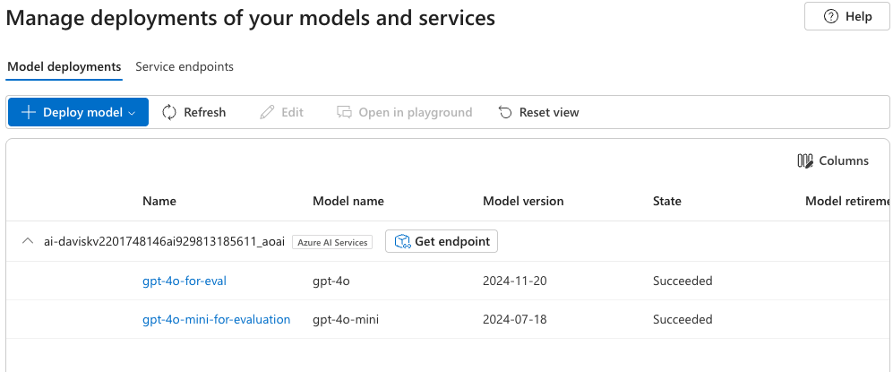
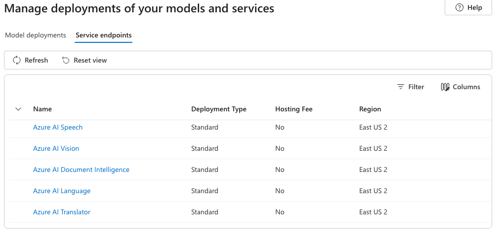
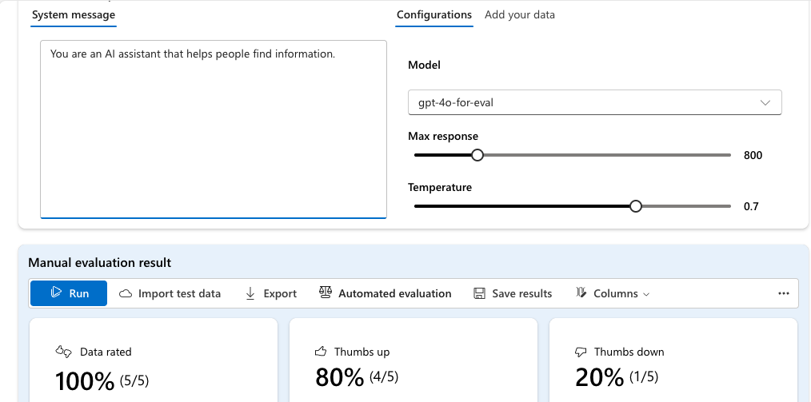
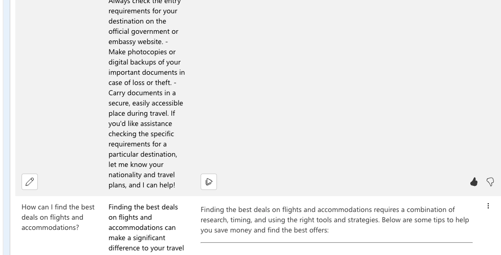

# Evaluate generative AI performance in Azure AI Foundry portal

Assume that we have fine turned a LLM open wieght model using a travel dataset.  One sample prompt and expected response from the dataset is given below. 

{
  "Question": "What documents are required for international travel?",

  "ExpectedResponse": "For international travel, the required documents can vary depending on your destination, nationality, and the purpose of your trip. However, here is a general list of the most commonly required documents for international travel: --- ### 1. **Passport**    - A valid passport is essential for international travel. Most countries require that your passport be valid for at least **6 months** beyond your planned departure date.    - Ensure your passport has enough blank pages for entry and exit stamps. ### 2. **Visa**    - Many countries require a visa for entry, which may be an electronic visa (e-visa), visa-on-arrival, or a pre-approved visa from an embassy.    - Research whether your destination requires a visa for your nationality, and apply well in advance if necessary. ### 3. **Flight Tickets**    - A copy of your **round-trip or onward travel ticket** is often required by immigration officials to prove that you plan to leave the country. ### 4. **Travel Insurance**    - Some countries mandate proof of travel insurance that covers medical expenses, accidents, and emergencies.    - Check if COVID-19 coverage or specific insurance is required for entry. ### 5. **Health Documentation**    - **Vaccination Certificates**: Some countries require proof of specific vaccinations (e.g., Yellow Fever vaccination if traveling from certain countries).    - **COVID-19 Requirements**: This may include proof of vaccination, a negative PCR test result, or a recovery certificate. Requirements vary by country. ### 6. **Accommodation Details**    - Proof of accommodation, such as a hotel reservation or an invitation letter from a host, may be required at immigration. ### 7. **Proof of Financial Means**    - You may need to show proof that you can financially support yourself during your stay, such as bank statements, credit cards, or cash. ### 8. **Travel Itinerary**    - A detailed travel itinerary, including places you plan to visit, may be required by immigration officials in some destinations. ### 9. **Driver’s License and International Driving Permit (IDP)**    - If you plan to drive abroad, bring your valid driver's license and, in some cases, an International Driving Permit. ### 10. **Additional Documents (if applicable):**    - **Work or Study Permits**: If traveling for work or study.    - **Parental Consent Letter**: If traveling with minors without both parents.    - **Customs Declarations**: For items like high-value goods or large amounts of cash.    - **Return to Residency Documents**: If you’re a resident of another country, carry your residency card or permit. --- ### Tips: - Always check the entry requirements for your destination on the official government or embassy website. - Make photocopies or digital backups of your important documents in case of loss or theft. - Carry documents in a secure, easily accessible place during travel. If you'd like assistance checking the specific requirements for a particular destination, let me know your nationality and travel plans, and I can help!"
}

We are interested in evaluating how well the fine-tuned model performs on this specific question is azure AI foundary portal.

Need to complete the following steps before evaluating the model:

## Create an Azure AI Foundry hub and project with following information:
  - Hub name: llm-eval-hub
  - Project name: travel-llm-eval
  - Description: Evaluation of fine-tuned LLM model on travel dataset
  - Region: East US
  - Resource group: llm-eval-rg

## Deploy models

you’ll evaluate the performance of a gpt-4o-mini model. You’ll also use a gpt-4o model to generate AI-assisted evaluation metrics.

1. In the navigation pane on the left for your project, in the My assets section, select the Models + endpoints page.
2. In the Models + endpoints page, in the Model deployments tab, in the + Deploy model menu, select Deploy base model.
3. Search for the gpt-4o model in the list, and then select and confirm it.
4. Deploy the model with the following settings by selecting Customize in the deployment details:

    - Deployment name: A valid name for your model deployment
    - Deployment type: Global Standard
    - Automatic version update: Enabled
    - Model version: Select the most recent available version
    - Connected AI resource: Select your Azure OpenAI resource connection
    - Tokens per Minute Rate Limit (thousands): 50K (or the maximum available in your subscription if less than 50K)
Content filter: DefaultV2  

5. Wait for the deployment to complete.
6. Return to the Models + endpoints page and repeat the previous steps to deploy a gpt-4o-mini model with the same settings.

You can see both deployed models in the Model deployments tab.

You can also see various services available and the endpoints for the deployed models in the Endpoints tab. 

Note that when you  deploy the customized model. This creates a dedicated endpoint that serves requests using your fine-tuned version—not the generic Azure-hosted model.

## Manual evaluation

You can manually review model responses based on test data. Manually reviewing allows you to test different inputs to evaluate whether the model performs as expected.
1. Back on the Azure AI Foundry portal tab, in the navigation pane, in the Protect and govern section, select Evaluation.
2. If the Create a new evaluation pane opens automatically, select Cancel to close it.
3. In the Evaluation page, view the Manual evaluations tab and select + New manual evaluation.
4. In the Configurations section, in the Model list, select your gpt-4o model deployment.
5. Change the System message to the following instructions for an AI travel assistant:

code
Assist users with travel-related inquiries, offering tips, advice, and recommendations as a knowledgeable travel agent.

6. In the Manual evaluation result section, select Import test data and upload the travel_evaluation_data.jsonl file you downloaded previously; scrolling down to map the dataset fields as follows:
Input: Question
Expected response: ExpectedResponse
7. Review the questions and expected answers in the test file - you’ll use these to evaluate the responses that the model generates.
8. Select Run from the top bar to generate outputs for all questions you added as inputs. After a few minutes, the responses from the model should be shown in a new Output column, like this:

9. Review the outputs for each question, comparing the output from the model to the expected answer and “scoring” the results by selecting the thumbs up or down icon at the bottom right of each response.
10. After you’ve scored the responses, review the summary tiles above the list. Then in the toolbar, select Save results and assign a suitable name. Saving results enables you to retrieve them later for further evaluation or comparison with a different model.

